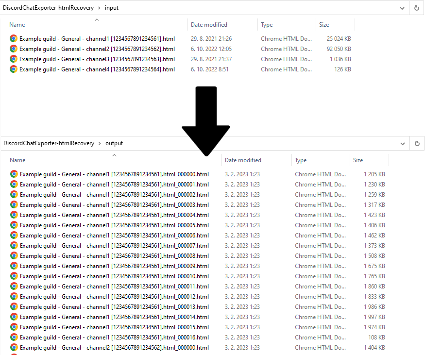

# DiscordChatExporter-htmlRecovery
Is your HTML export made by [DiscordChatExporter](https://github.com/Tyrrrz/DiscordChatExporter) too large to open in your browser? This script will split HTML export into multiple partitions (files), each of which is small enough to open in your browser.

## Usage

Make sure you have Python3 and Git installed.

1. Download the script

```bash
git clone https://github.com/slatinsky/DiscordChatExporter-htmlRecovery
cd DiscordChatExporter-htmlRecovery
```

2. Move your HTML files into the `input` directory

3. Run the script
```bash
python3 ./recover.py
```

4. The output files will be in the `output` directory

## Modify partition size
Edit file `recover.py` and change the value of `message_groups_per_page` to your desired partition size. Default value is `1000` message groups per partition.

## Tested on
[DiscordChatExporter](https://github.com/Tyrrrz/DiscordChatExporter) version `2.36.2` (2022-10-06) and version `2.30.1` (2021-08-30) - `HTML` export format

## License

GNU GENERAL PUBLIC LICENSE

## Contributing

Feel free to open issues and pull requests.

If you find this project useful, please consider starring it here on GitHub :)